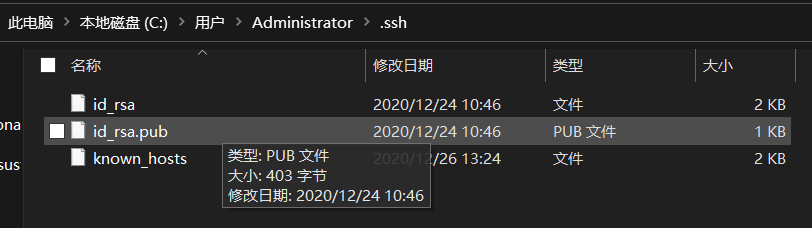
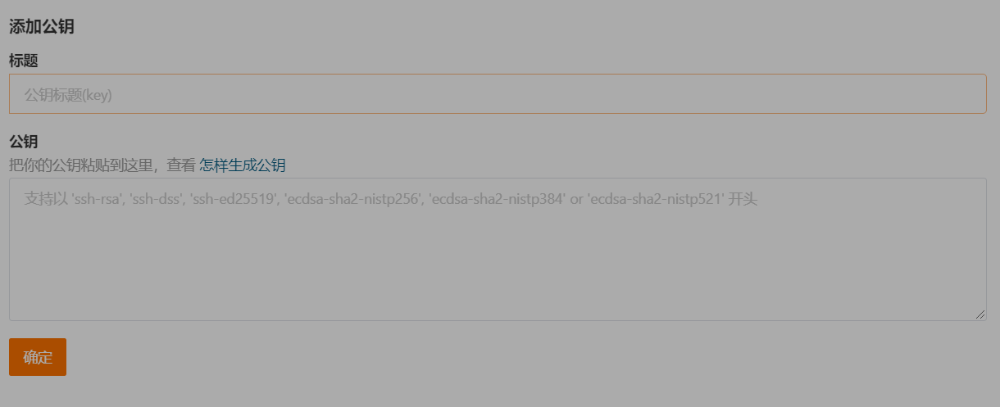

# ACMer 学习仓库

这是一个方便互相学习交流的算法竞赛代码仓库。

## 目录

[1. 如何使用](#1-如何使用)

[2. 规范](#2-规范)

[3. OJ 题目代码简写](#3-oj-题目代码简写)

[4. 仓库结构](#4-仓库结构)

[5. Git 的基本使用](#5-git-的基本使用) 

## 1. 如何使用

本仓库大部分的文件都是 AC 代码，因为文件过多且不包含题目，所以通过查阅代码来学习并不方便，建议先阅读参与人员的[笔记](#1-1-笔记)。

### 1.1 笔记

> 记笔记是个好习惯。

- [Jax's note](./jax/note.md)

## 2. 规范

1. 为了避免乱码影响阅读，所有文件都应该以英文名开头，可以添加中文后缀解释说明，文件内可以使用中文。

2. 为了一致性，文件名最好都使用小写，单词之间用下划线或减号分隔，例如：`book-problem`, `19_trails_i.cc`。  

3. 为了让其他人能更快地上手，应该编写简单易懂的说明文档，可以在文件夹下放置一个 `README.md` 描述这个文件夹是干什么用的，或是在下面的仓库结构添加文件或文件描述。  

## 3. OJ 题目代码简写

1. acw：[ACWing](https://www.acwing.com/) 上的题目代码，例如：`acw99.cc` 表示 ACWing 上的第 99 题。  

2. ch：[Contest Hunter](http://noi-test.zzstep.com/) 上的题目代码，例如：`ch0101.cc`。  

3. cf：[CodeForces](https://codeforces.com/)。  

## 4. 仓库结构

### 概览

```bash
# 该概览由 'tree -L 2' 命令生成，可能不会及时更新
.
├── cyj
│   ├── cf
│   ├── data-structure
│   ├── dynamic-programming
│   ├── graph-theory
│   ├── math
│   ├── search
│   └── train
├── jax
│   ├── 21-03
│   ├── 21-04
│   ├── 21-05
│   ├── 21-ladder-competition-天梯赛
│   ├── 21-summer-暑训
│   ├── classic-经典算法
│   ├── codeforces
│   ├── note.md
│   └── old
├── lqw
│   └── hello.cpp
├── old
│   ├── 21-trails-集训队选拔赛
│   ├── misc-杂项
│   ├── train-训练
│   ├── vj
│   └── weekly-contest-周赛
├── README.md
├── resource
│   ├── 21-03-21-id.png
│   ├── 21-03-21-shotcut.png
│   └── clean.ps1
└── share
    ├── algorithm-advance-算法进阶指南
    └── compare-对拍

28 directories, 6 files
```

### 解释

普通文件不加斜杠，例如：`example.txt`；加斜杠表示目录，例如：`dir/`。  

> 未列出所有文件或文件夹  

- [cyj/](./cyj) （cyj的刷题代码）  

- [jax/](./jax)（[Jax]（https://jaxvanyang.github.io) 的代码）  
    该目录下的文件夹以日期命名，表示存放的是哪一天的代码  
    - [21-03-21](./jax/21-03-21)  

- [lqw/](./lqw)（lqw的刷题代码）  

- [old/](./old)（遗留的，大多是未经整理的代码）  

- [share/](./share)（共享的文件或文件夹）  

## 5. Git 的基本使用

Git 是一个用于版本控制的命令行工具，可以很方便地备份和恢复各个时间节点的代码，再加上 GitHub，在不同设备上的同步也变得简单便捷。  

> ！注意，这里的所说的基本使用真的十分基本，甚至你看完后依然会碰到一堆问题，建议在使用过程中熟练运用搜索引擎，如果发现本文有任何失误或一些基本操作没有设计，欢迎纠正和丰富本文内容，这也可以当作使用 Git 的练习。BTW，《Pro Git》是相当好的一本介绍 Git 的书，推荐阅读：<https://gitee.com/progit/>  

### Git 的安装

Windows 到官网下载无脑下一步。

### Git 的基本概念

1. 仓库（repository）：代码存放的目录，Git 只能操作仓库下的文件。  

2. 文件的状态：在 Git 里文件大概可以分成四种状态：未跟踪、已修改、已暂存和已提交。  

    1. 未跟踪：顾名思义就是 Git 不管的文件，提交时不会打包到压缩包里。  

    2. 已修改：之前已经提交过的文件后又经过修改的文件。  

    3. 已暂存：使用 `git add` 后文件的状态，这个状态是为了给提交做准备，提交的时候会将暂存的文件打包进压缩包里。  

    4. 已提交：已经存在之前提交里并没有修改过的文件。  
    
3. 提交（commit）：就是选中文件的备份，Git 会在每次提交的时候将已跟踪的文件打包进一个压缩包，恢复以前代码的原理就是解压之前提交的压缩包。  

### Git 的常用命令

之前提到，Git 是一款命令行工具，虽然现在各种 IDE 和编辑器（如 VS Code）都提供了 Git 插件支持，但是想要用好 Git 还是需要对命令行有一定的了解，如果只是想要能用的话，真的只需要会敲一点点命令就行。  

1. 配置 Git 的用户信息  

    这一步就相当于注册账号时的完善个人信息，因为一个仓库可能有多个人参与，所以 Git 必须要通过用户信息来分辨谁是谁。  
    ```bash
    # 设置名字和邮箱，只需要设置一次
    git config --global user.name "your name"
    git config --global user.email "your email"
    ```

2. 初始化一个仓库  

    Git 的使用是有条件的，就是必须要在仓库下进行，使用 `git init` 后，Git 会在当前目录下新建一个隐藏目录 `.git/` 表示这是一个仓库，你也可以把 `.git/` 当作版本库。  
    ```bash
    git init
    ```

3. 克隆一个仓库  

    克隆就是将别人的仓库复制过来，内容完全一样，并且也拥有所有提交的历史记录。注意是将仓库复制到当前路径，而不是将仓库中的内容复制到当前路径，试一试就知道是什么意思了。  
    ```bash
    # git clone 后面的是本仓库的链接
    git clone git@gitee.com:chu_ying_jie/acm.git
    ```

4. 查看仓库的状态  

    输入后可以看到当前仓库有哪些文件修改过，以及一些提示。  
    ```bash
    git status
    ```
    例如（注释是加上去的）：  
    ```bash
    On branch master    # 在主分支
    Your branch is up to date with 'origin/master'. # 你的分支和远程分支同步

    Changes not staged for commit:  # 没有暂存的提交
    (use "git add <file>..." to update what will be committed)  # 告诉你怎么暂存的提示
    (use "git restore <file>..." to discard changes in working directory)   # 告诉你怎么取消暂存的提示
            modified:   ../../README.md # 修改的文件

    no changes added to commit (use "git add" and/or "git commit -a")   # 提示你没有修改被暂存
    ```

5. 暂存文件  

    前面 `git status` 给出的信息已经提示了如何暂存，这里主要就讲一下几个比较方便的变体：  
    ```bash
    git add .   # 暂存当前目录下的所有文件，单独一个 . 代表当前目录
    git add *.cpp   # 暂存当前目录下的所有以 .cpp 结尾的文件，* 表示通配符，可以匹配任意长度任意字符
    git add -A  # 暂存所有文件，不仅仅是当前文件夹下，-A 表示 All
    ```

5. 提交  

    假设你已经知道了文件暂存是什么意思了，那么提交就是将暂存的文件保存到版本库中。  
    ```bash
    git commit  # 不指定提交信息，回车后系统会自动生成一个文件让你输入提交信息
    git commit -m 'some message'    # 用括号括起来的就是提交信息，系统就不会再生成文件让你输入了
    ```

6. 推拉  

    假如你现在已经在你的机器上写好了一份 AC 代码想要和别人分享，那该怎么办呢？很简单，使用 `git push` 就能将你本地的仓库和远程仓库合并，这样远程仓库里的文件就和你本地的一样了，不过有一点需要注意，就是除了你还可能有别人在你之前修改了仓库，这个时候直接 `pull` 是行不通的，你必须先将别人的修改拉下来（`git pull`）再把自己的代码推上去。  
    ```bash
    git pull    # 将远程仓库的修改同步到本地仓库
    git push    # 建议每次推代码上去的时候都先 git pull 一下
    ```

7. 获取访问权限  

    很多仓库都是公开的，但不是你的仓库，你可能就没有权限去修改，在 GitHub 或 Gitee 上管理员可以授予成员权限，但 Git 为了让权限被对的人使用就必须知道尝试**推代码**的人的身份，仅仅使用之前配置过的名字和邮箱是不够的，因为这个很容易伪造。Git 的解决方法有两个：密码和密钥。因为密码访问很简单而且不方便这里就不赘述了，下面我们来简单介绍一下如何使用 `SSH 连接`。  

    1. 生成 RSA 密钥对：  

        ```bash
        # 这条命令会在你的家目录下的 .ssh/ 文件夹下产生两个文件
        # 一个是自己保管的私钥，一个是等会要放到服务器上的公钥
        # 如果碰到停顿敲回车就好了
        ssh-keygen -t rsa -C "xxxxx@xxxxx.com"
        ```

    2. 将公钥复制到 Gitee 或 GitHub 上：  

        这里我们以 Gitee 为例。  

        1. 进入家目录下的 `.ssh/` 目录找到公钥 `id_rsa.pub`，打开并复制其中的内容。  

            

        2. 进入 Gitee 的密钥设置页面：<https://gitee.com/profile/sshkeys>，粘贴提交完事。  

            

        3. 现在使用 `git push` 查看是否成功：  

            ```bash
            git push
            # 以下是成功信息
            Enumerating objects: 9, done.
            Counting objects: 100% (9/9), done.    
            Delta compression using up to 8 threads
            Compressing objects: 100% (6/6), done. 
            Writing objects: 100% (6/6), 43.55 KiB | 3.11 MiB/s, done.
            Total 6 (delta 1), reused 0 (delta 0), pack-reused 0      
            remote: Powered by GITEE.COM [GNK-5.0]
            To gitee.com:chu_ying_jie/acm.git    
            58cd1c9..d61fced  master -> master
            ```

### Git 的使用技巧

1. 使用别名简化使用，例如：  

    ```bash
    # 设置 git info 为 'git log --pretty=format:"%h - %an, %ar : %s" --graph' 这一长串命令的别名
    git config --global alias.info 'log --pretty=format:"%h - %an, %ar : %s" --graph'
    # 设置好后就可以直接使用查看格式化的 git 日志
    git info
    ```